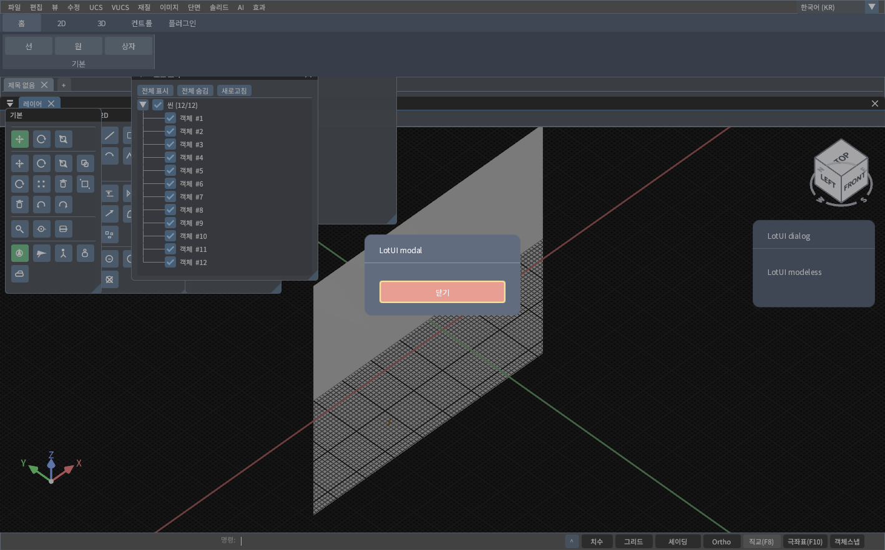
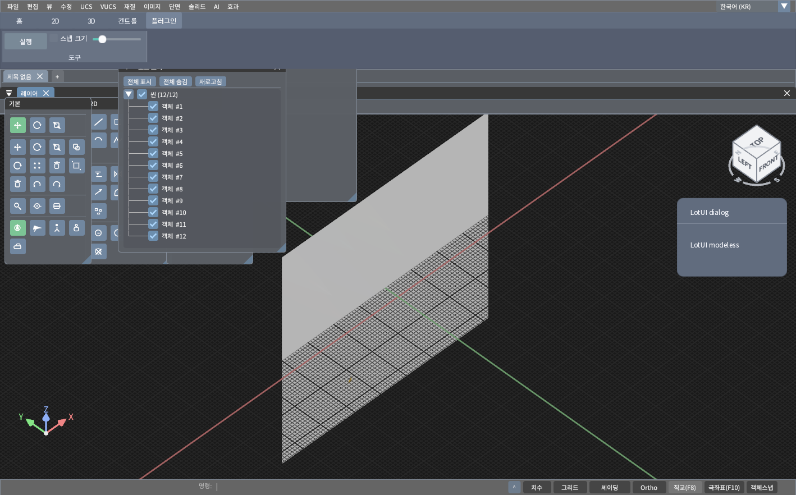

# VulkanCAD ribbon smoke

`../3dengine/samples/lotui_smoke/main.cpp` is copied from this directory.
The sibling engine's `VulkanAppLotGUI` target compiles the required LotUI
`.cpp` files directly into one executable. It uses the LotUI CMake subproject
only to configure the FreeType and HarfBuzz dependencies. There is no LotUI
DLL, and the existing `VulkanApp` remains a separate executable.

The smoke replaces only the built-in and plugin ImGui ribbon region. The CAD
viewport, menus, toolbars, docking panels, and status bar still use their
existing implementation. The Home/2D/3D tabs contain representative commands,
not the full built-in ribbon command set. The Controls tab exercises a button,
slider, modal dialog, and modeless dialog.

The embedded renderer borrows the engine's device, render pass, command
buffer, graphics queue, and queue family. It owns its glyph atlas images and
uploads them with a transient command buffer; it never owns the swapchain or
presents. Uploads currently wait for the graphics queue to become idle, so
atlas update performance still needs work before a full UI migration.

## Build and run

From the LotGUI repository root on Windows:

```powershell
cmake -S ../3dengine -B ../3dengine/build
cmake --build ../3dengine/build --config Release --target VulkanAppLotGUI
../3dengine/build/Release/VulkanAppLotGUI.exe
```

Run from the engine's Release output directory to use its assets and DLL:

```powershell
./VulkanAppLotGUI.exe --input-test ribbon-input.png
./VulkanAppLotGUI.exe --capture ribbon.png
./VulkanAppLotGUI.exe --capture-plugin ribbon-plugin.png
```

`--input-test` checks modal opening, slider dragging, plugin button dispatch,
plugin checkbox/slider state callbacks, and removal after unregistering.

## Plugin ribbon controls

Plugins continue to register commands and ribbon items through the engine C
API. The LotUI ribbon reads the same registry and rebuilds its tabs when an
item is added or removed. No `lotui::Widget*` crosses the plugin ABI boundary.

```cpp
CAD_RegisterCommand("my_tool", "My tool", &onMyTool, user, owner);
CAD_AddUiItem(3, "My tab/My group", "My tool", "my_tool", nullptr, owner);
CAD_RegisterCommand("my_toggle", "My toggle", &onToggle, user, owner);
unsigned int toggle = CAD_AddUiControl(5, "My tab/My group", "Snap",
    "my_toggle", 0.0, 1.0, 0.0, owner);
CAD_RegisterCommand("my_scale", "My scale", &onScale, user, owner);
unsigned int scale = CAD_AddUiControl(6, "My tab/My group", "Scale",
    "my_scale", 0.0, 10.0, 2.0, owner);
// The command callbacks read values using CAD_GetUiControlValue(id, ...).
// On unload:
CAD_RemoveUiItemsByOwner(owner);
CAD_UnregisterCommandsByOwner(owner);
```

Ribbon buttons, checkboxes, and sliders are supported through this contract.
Numeric text fields and plugin panel content still need a typed, host-owned
control API. Keyboard/IME routing to LotUI is not yet integrated.
The current capture was verified on Windows; macOS and Linux configurations
still require their own build and runtime checks.




